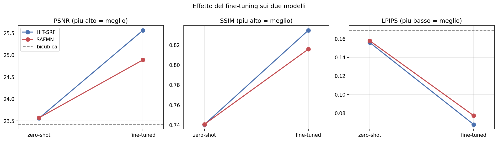
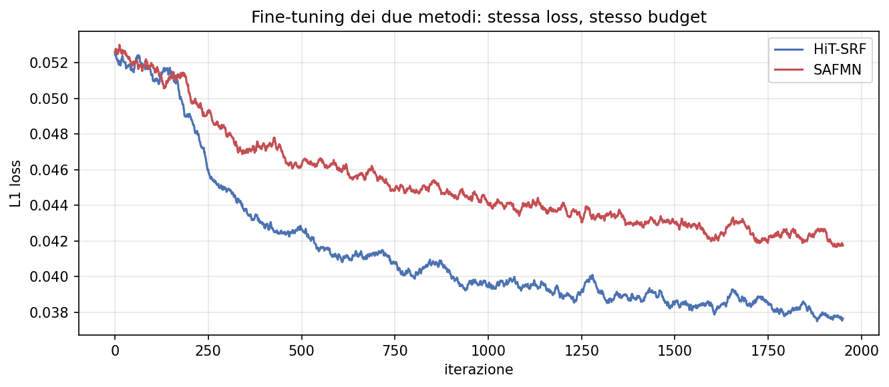
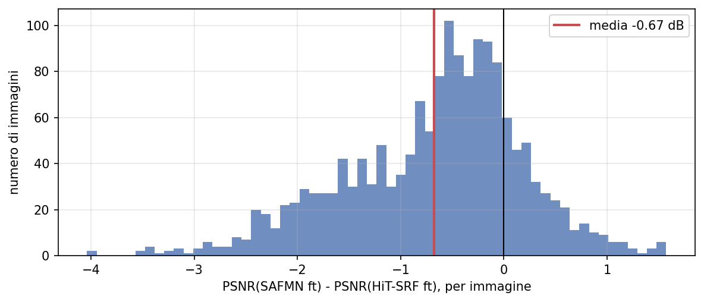
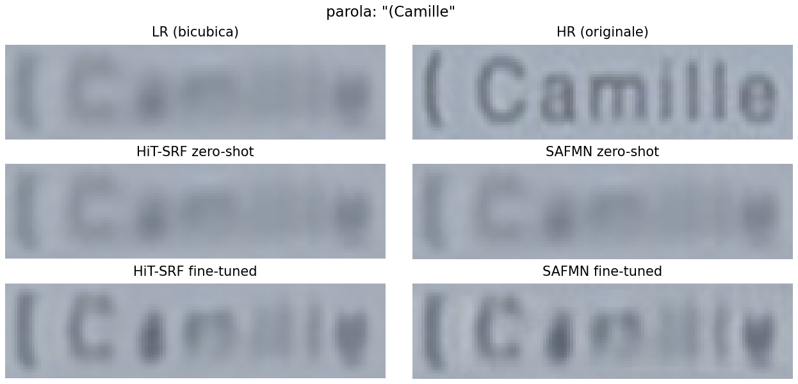
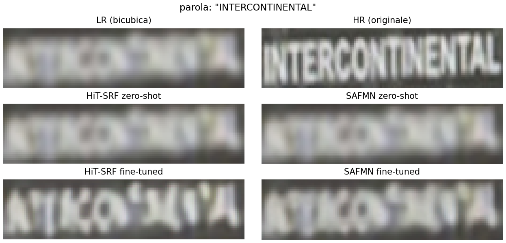

# Super-Resolution on TextZoom: a Transformer and a CNN compared

**Computer Vision course** - University of Catania
Academic year 2025/2026 - prof. S. Battiato, F. Guarnera

| Student | Student ID | Method developed |
|---|---|---|
| Alessandro Sciacca | 1000085546 | Method 1 - HiT-SRF |
| Lorenzo Comis | 1000084704 | Method 2 - SAFMN |

---

## 1. Introduction

This project addresses the problem of **Single Image Super-Resolution (SISR)**: reconstructing a high-resolution image from a single low-resolution one. The case studied here is that of text crops photographed from signs and billboards, at an upscaling factor of 2: from 16x64 pixel images to 32x128 ones.

Within the project, **two different architectures were compared on the same task and the same dataset**, each developed by one of the two students:

- **HiT-SRF** (ECCV 2024), a Transformer with hierarchical window attention;
- **SAFMN** (ICCV 2023), a fully convolutional network based on multi-scale spatial modulation.

The choice is not arbitrary. The two models belong to opposite architectural families but are **pre-trained on the same dataset (DF2K), at the same scale**, and in this work they are adapted to the same domain through an identical procedure. The only variable that changes is therefore the architecture, and the comparison takes the form of a controlled experiment.

This makes it possible to answer a question more interesting than "which of the two models is better": **how much does the choice of architecture weigh, compared to adaptation to the application domain?** The results show that the second factor is worth about fifteen times the first, and that zero-shot the two architectures are indistinguishable from one another.

## 2. The dataset

### Why TextZoom and not DIV2K

An earlier version of this work used DIV2K, the standard dataset for super-resolution. Fine-tuning, however, produced no appreciable improvement, for a simple reason: both models chosen here have already been pre-trained by their authors on **DF2K**, that is, DIV2K together with Flickr2K. Fine-tuning was presenting the networks with the very same data they had already seen.

Adaptation only makes sense when the target domain is **different** from the pre-training one. **TextZoom** (ECCV 2020) is different in two respects.

**The low-resolution images are real, not synthetic.** In classic datasets the LR version is obtained by downscaling the HR one with bicubic interpolation: a clean, deterministic degradation, always identical to itself. In TextZoom, instead, **both versions were photographed**, by varying the focal length of the camera. The LR image therefore contains real optical blur, sensor noise and compression artifacts, that is, a kind of degradation the models have never encountered during training.

**The content is of a different nature.** DF2K consists of natural photographs: landscapes, animals, people. TextZoom is made of text, which has almost opposite visual properties.

| | Natural photos | Text |
|---|---|---|
| Edges | soft, irregular | sharp, high-contrast |
| Texture | abundant | nearly absent |
| Structures | organic, variable | thin, regular strokes |

There is, finally, a practical advantage that is not negligible: on a landscape it is hard to judge by eye whether super-resolution has worked, whereas on a sign the criterion is immediate, because either the word can be read or it cannot.

### Composition and limitations of the dataset

TextZoom is distributed in lmdb format. The LR images measure 16x64 pixels and the HR ones 32x128, so the scale factor is **2**, not 4 as in most benchmarks: consequently, the x2 versions of both models were used.

**2794 pairs were used for training** and the **1619 images** of the `easy` test subset for evaluation.

The choice of `easy` deserves an explanation. Since LR and HR are two distinct shots, **they are not perfectly aligned pixel by pixel**. Metrics such as PSNR and SSIM, which compare pixels at the same position, are penalised by this misalignment, which in the test set grows when moving from the `easy` level to `medium` and `hard`. Restricting the evaluation to `easy` contains the problem, at the price of not measuring how the models behave on the harder cases.

## 3. Experimental pipeline

Everything that is common to the two methods was defined once and shared: dataset loading, splits, metrics, baseline and evaluation functions. Each method only has to provide a function that, given an LR image, returns the super-resolved image; the evaluation is therefore identical by construction.

### Baseline

The minimum reference is **bicubic interpolation**: no model, no training, just upscaling. It answers the question "is the model actually adding information, or is it merely enlarging?". A model that does not beat bicubic interpolation is of no use at all.

### Metrics

Three complementary metrics were adopted, computed over all 1619 test images:

- **PSNR**, the signal-to-noise ratio derived from the mean squared error. It measures pixel-by-pixel fidelity and is the reference metric of the super-resolution literature. Higher is better.
- **SSIM**, which compares local structure (edges, contrast) instead of individual pixels. Higher is better.
- **LPIPS**, which compares images in the feature space of a neural network and is the closest to human perceptual judgement. Lower is better.

Each metric is reported with its own **95% confidence interval** on the mean. In addition, the per-image scores were kept, which allows the paired comparison described in the results section.

### Adaptation procedure

Both models were fine-tuned with an **identical** recipe:

| Parameter | Value |
|---|---|
| Loss | L1 |
| Optimiser | Adam |
| Learning rate | 1e-5 |
| Iterations | 2000 |
| Batch size | 16 |
| Trained parameters | the whole network |
| Input | whole images, without crops |

The learning rate is two orders of magnitude below that of training from scratch (2e-4): the models are already competent in general, and the point is to specialise them on the new domain without destroying what they have already learned. The entire network is trained, and not only the last layers, because, unlike in classification, the task itself does not change here, and the ability to generate detail is distributed throughout the architecture.

Keeping the procedure identical is the condition that makes the comparison interpretable: same pre-training data, same adaptation data, same training budget. What remains different is the architecture.

## 4. Method 1 - HiT-SRF

HiT-SRF is a Transformer for super-resolution presented at ECCV 2024.

Transformers rely on *attention*, which relates every pixel to every other one: a powerful mechanism, but one with quadratic cost, untenable on a whole image. The classic solution, introduced by SwinIR, consists in computing attention only inside windows of fixed size, with the limitation that the model always observes at a single scale.

The idea of HiT-SR is to **let the windows grow with the depth of the network**: the first layers use small windows and capture fine details, the later ones progressively larger windows that gather context. To keep the cost from exploding, the classic attention is replaced by a mechanism whose cost grows linearly rather than quadratically.

The model has **846,944 parameters**, an order of magnitude fewer than full-size Transformers for super-resolution, which makes fine-tuning feasible on a T4 GPU.

One architectural constraint is relevant for this work: the network **requires inputs whose dimensions are multiples of 64**. Since the LR images of TextZoom are 16x64, every image has to be extended with padding up to 64x64 and the excess cropped from the result. The network therefore processes four times the useful area, with consequences on timing that will be discussed further on.

## 5. Method 2 - SAFMN

SAFMN (*Spatially-Adaptive Feature Modulation*, ICCV 2023) is a **fully convolutional** network: no self-attention, no Transformer-like mechanism.

Its stated goal is to obtain a multi-scale view without paying the cost of attention. Each block splits the features into groups and processes each group at a different resolution: one at full resolution for the fine details, the others progressively downscaled for context. The groups are then recombined by using the low-resolution maps to **modulate** the high-resolution ones, that is, to decide region by region how much each feature should count. The result is a model designed for execution on mobile devices.

The configuration of the x2 weights published by the authors corresponds to 36 channels and 8 blocks, for a total of **227,820 parameters**, roughly a quarter of HiT-SRF. Being entirely convolutional and based on adaptive downscalings, the network accepts images of any size: unlike Method 1, no padding is required.

## 6. Results

### Overall picture

| Method | PSNR (dB) | SSIM | LPIPS |
|---|---|---|---|
| Bicubic (baseline) | 23.42 ± 0.14 | 0.7359 ± 0.0054 | 0.1691 ± 0.0045 |
| HiT-SRF zero-shot | 23.56 ± 0.14 | 0.7404 ± 0.0056 | 0.1559 ± 0.0045 |
| **HiT-SRF fine-tuned** | **25.56 ± 0.12** | **0.8346 ± 0.0039** | **0.0676 ± 0.0025** |
| SAFMN zero-shot | 23.57 ± 0.14 | 0.7406 ± 0.0056 | 0.1579 ± 0.0045 |
| SAFMN fine-tuned | 24.89 ± 0.11 | 0.8157 ± 0.0041 | 0.0772 ± 0.0025 |

*Figure 1. Effect of fine-tuning on the three metrics. The two models start out overlapping and just above the baseline; after adaptation they separate, with HiT-SRF ahead.*

### Fine-tuning and its curves

*Figure 2. The two curves are directly comparable: same loss, same data, same number of iterations.*

### Are the differences real?

The confidence intervals in the table measure the uncertainty of each mean taken in isolation, and that uncertainty is dominated by the fact that some images in the test set are intrinsically easy and others hard. On their own, they do not make it possible to establish whether one method is better than another.

Since the methods are evaluated on the **very same images**, the correct comparison is a paired one: the difference is computed image by image and its distribution is studied. The resulting uncertainty is much smaller, and in addition one obtains a piece of information the mean does not contain, namely **how often** a method prevails.

| Comparison (mean difference, 95% CI) | PSNR | SSIM | LPIPS |
|---|---|---|---|
| HiT-SRF ft minus SAFMN ft | +0.674 [+0.631, +0.716] | +0.0188 [+0.0177, +0.0199] | -0.0096 [-0.0104, -0.0087] |
| Images on which HiT-SRF prevails | 80.7% | 81.7% | 78.3% |

| Comparison against the baseline (PSNR) | Mean difference, 95% CI | Images on which it prevails |
|---|---|---|
| HiT-SRF zero-shot minus bicubic | +0.142 [+0.120, +0.164] | 58.6% |
| SAFMN zero-shot minus bicubic | +0.152 [+0.131, +0.173] | 65.5% |

None of the intervals contains zero: all the gaps are therefore **systematic**, not effects of chance. The advantage of HiT-SRF after adaptation is real and recurrent, present on roughly four images out of five and consistent across all three metrics. The advantage of the pre-trained models over bicubic interpolation, on the contrary, is statistically real but **practically irrelevant**: 0.14 dB, with a win rate barely above a coin toss.

*Figure 3. Distribution of the per-image differences. Mind the sign: the subtraction is SAFMN minus HiT-SRF, so negative values indicate that HiT-SRF is better. The black line marks the tie, the red line the mean.*

The figure shows two properties that the mean alone conceals. The distribution is a **single hump** shifted to the left of zero, not two distinct populations: the advantage is spread across the whole dataset and is not produced by a particular subset of images. And it is **skewed**: the tail extends to -4 dB on one side and stops at around +1.6 on the other, which means that when HiT-SRF prevails it can prevail clearly, whereas when SAFMN prevails it does so only slightly.

### Visual comparison

*Figure 4. At the top, the input upscaled bicubically (which coincides with the baseline) and the original high-resolution image. Below, the two models before and after fine-tuning: HiT-SRF in the left column, SAFMN in the right one.*

Visual inspection confirms the numbers. The two zero-shot reconstructions are indistinguishable from each other and almost indistinguishable from the bicubic upscaling. After fine-tuning, both models markedly increase the contrast between the characters and the background, separating strokes that were merged in the input. The difference between the two adapted versions, on the other hand, is hard to catch with the naked eye, consistently with the modest gap measured by the metrics.

### Computational cost

| Model | Parameters | Training (min) | Inference (ms/img) |
|---|---|---|---|
| HiT-SRF | 846,944 | 44.6 | 173.1 |
| SAFMN | 227,820 | 1.1 | 8.2 |

Timings were measured on a T4 GPU. HiT-SRF has 3.7 times the parameters of SAFMN, yet it is **twenty-one times slower at inference and forty times slower in training**.

## 7. Discussion

The sharpest result of the whole work lies in the two zero-shot rows of the table: 23.56 against 23.57 dB, 0.7404 against 0.7406 of SSIM. A Transformer and a CNN that share almost nothing structurally produce, on the same 1619 images, the very same result. Since the two models have their pre-training dataset in common but not their architecture, the coincidence is hardly accidental: when applied outside the domain they were trained for, **it is the pre-training that determines performance, not the way the network is built**. As long as the model works on data that does not resemble what it saw during training, architectural sophistication yields no advantage whatsoever.

The second element that emerges is the **scale of the gains**. Replacing bicubic interpolation with a state-of-the-art model, without retraining it, is worth 0.14 dB: a margin that the paired comparison recognises as systematic, but one that in practice changes nothing. Adapting that same model to the domain is worth 2.00 for HiT-SRF and 1.32 for SAFMN. The ratio between the two factors is roughly fifteen to one, and the dominant one has nothing to do with the network, but with the data it was trained on.

It is only after adaptation that the architectural difference becomes visible. HiT-SRF prevails by 0.674 dB and does so systematically, proving better on about 80% of the images and on all three metrics: a gap so widely distributed cannot be produced by a particular subset of the test set. The advantage is therefore real, but its magnitude has to be measured in the right way. Comparing the two absolute PSNR values would be misleading, because both contain the 23.42 dB one obtains without any model at all; the meaningful comparison is between the respective gains over the baseline, 2.14 dB for HiT-SRF and 1.47 for SAFMN. Read in these terms, the difference says that **SAFMN obtains about two thirds of the available improvement while using one twentieth of the compute time**.

That very gap in time deserves a separate explanation, because it contradicts the intuition that ties computational cost to parameter count: HiT-SRF has 3.7 times as many as SAFMN, yet it is twenty-one times slower. There are two causes. The first is the constraint on input dimensions, which forces every image to be extended from 16x64 to 64x64 and leads the network to process four times the useful area. The second, which accounts for the remaining factor, is the intrinsic cost of attention compared to convolution. The model designed for efficiency thus turns out to be the slower of the two, and parameter count proves to be an unreliable indicator of actual cost.

It follows that the question of which of the two models is better **admits no single answer**. For maximum reconstruction quality the choice is the Transformer; for any use in which compute time carries weight, such as processing large numbers of frames or running on resource-constrained devices, the lightweight CNN is the more sensible choice.

## 8. Limitations

A few caveats accompany the results just discussed. The comparison on timings, first of all, penalises HiT-SRF in a way that depends on the dataset more than on the model: the padding from 16x64 to 64x64 is made necessary by the unusually small size of TextZoom images, and on ordinary-sized images that extra cost would disappear, narrowing the speed gap. The factor of twenty-one should therefore be read as a property of the experimental scenario, not of the two architectures in general.

The evaluation is moreover limited to the `easy` subset of the test set: the `medium` and `hard` levels, in which the misalignment between the two shots is greater, were not measured, and nothing observed here can be automatically extended to the harder cases.

It should finally be recalled that both methods belong to the regression family. Generative models for super-resolution were left out of the comparison for practical reasons: the reference GANs of the field date back to 2021 and did not meet the recency criterion adopted here, while diffusion models operate at scale x4 on much larger images and are not trainable with the available resources. What emerges from this work therefore concerns two ways of building the architecture, and not two ways of defining the optimisation objective.

*Figure 5. One of the crops on which the better method obtains its worst LPIPS score. The original word is "INTERCONTINENTAL", but in the input that information is by now lost: after fine-tuning both models produce sharp and entirely wrong characters. Increasing contrast is not the same as recovering content.*

## 9. Conclusions

The comparison between a Transformer and a CNN for super-resolution, carried out with the same pre-training data, the same target domain and the same adaptation procedure, leads to a conclusion that neither of the two models would show on its own: **on a new domain, adaptation matters far more than the architecture**. The gain obtained by specialising a model on its application domain is about fifteen times the one obtained by replacing an interpolation with a state-of-the-art model, and before that specialisation the two networks, profoundly different from each other but pre-trained on the same data, fail indistinguishably. The limit does not lie in how the network processes the image, but in what it has learned to reconstruct.

After adaptation the architectural difference emerges, but it has to be weighed against cost: HiT-SRF is systematically better, on about 80% of the images and by 0.674 dB, while SAFMN obtains 69% of the same improvement at one twenty-first of the inference cost. Which of the two is preferable therefore depends on the dominant constraint of the application, and a comparison stopping at the PSNR value alone would not be enough to settle it.

A natural development of this work consists in extending the evaluation to the `medium` and `hard` subsets, and in complementing the adopted metrics with a measure of text recognition accuracy through OCR, which on the TextZoom domain would answer the most direct question of all: whether the word, after reconstruction, is actually legible.

## 10. References

- X. Zhang et al., *HiT-SR: Hierarchical Transformer for Efficient Image Super-Resolution*, ECCV 2024. [arXiv:2407.05878](https://arxiv.org/abs/2407.05878) - [repository](https://github.com/XiangZ-0/HiT-SR)
- L. Sun et al., *Spatially-Adaptive Feature Modulation for Efficient Image Super-Resolution*, ICCV 2023. [arXiv:2302.13800](https://arxiv.org/abs/2302.13800) - [repository](https://github.com/sunny2109/SAFMN)
- W. Wang et al., *Scene Text Image Super-Resolution in the Wild*, ECCV 2020. [arXiv:2005.03341](https://arxiv.org/abs/2005.03341) - [repository](https://github.com/WenjiaWang0312/TextZoom)
- R. Zhang et al., *The Unreasonable Effectiveness of Deep Features as a Perceptual Metric*, CVPR 2018 (LPIPS metric). [arXiv:1801.03924](https://arxiv.org/abs/1801.03924)
